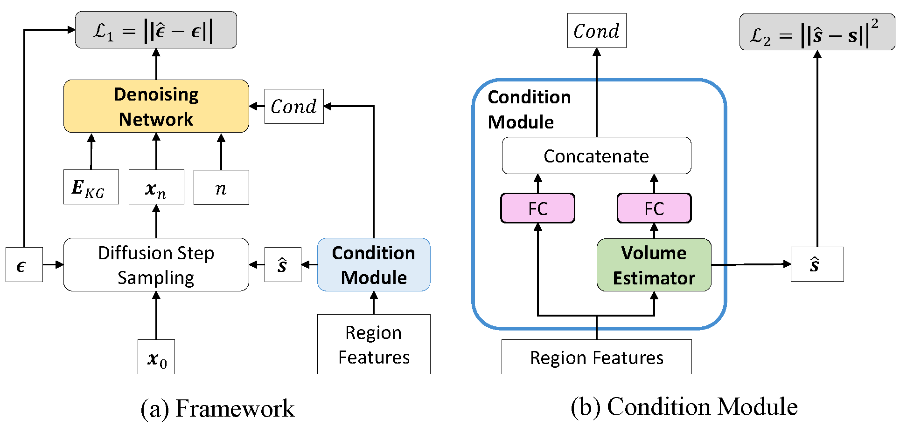

# Urban flow generation

The official PyTorch implementation of "Towards Generative Modeling of Urban Flow through Knowledge-enhanced Denoising Diffusion" (SIGSPATIAL'23).

NYC dataset is included.

The code is tested under a Linux desktop with torch 1.9.0 and Python 3.8.10.

## Installation

### Environment
- Tested OS: Linux
- Python >= 3.8
- PyTorch == 1.9.0
- torch_geometric == 1.7.2

### Dependencies
1. Install PyTorch 1.9.0 with the correct CUDA version.
2. Use the ``pip install -r requirements. txt`` command to install all of the Python modules and packages used in this project.

## Usage

Pretrain to get KG embeddings:
```
bash pretrain.sh
```

Train diffusion model:

```
bash train.sh
```

Generate urban flow:

```
bash sample.sh
```

Evaluate generated flow:

```
python evaluate.py
```

## More Related Works

- [Hierarchical Knowledge Graph Learning Enabled Socioeconomic Indicator Prediction in Location-Based Social Network (WWW '23)](https://github.com/tsinghua-fib-lab/KG-socioeconomic-indicator-prediction)

## Note

The implemention is based on *[DDPM](https://github.com/lucidrains/denoising-diffusion-pytorch)*.

If you found this library useful in your research, please consider citing:

```
@article{zhou2023towards,
  title={Towards Generative Modeling of Urban Flow through Knowledge-enhanced Denoising Diffusion},
  author={Zhou, Zhilun and Ding, Jingtao and Liu, Yu and Jin, Depeng and Li, Yong},
  journal={arXiv preprint arXiv:2309.10547},
  year={2023}
}
```


